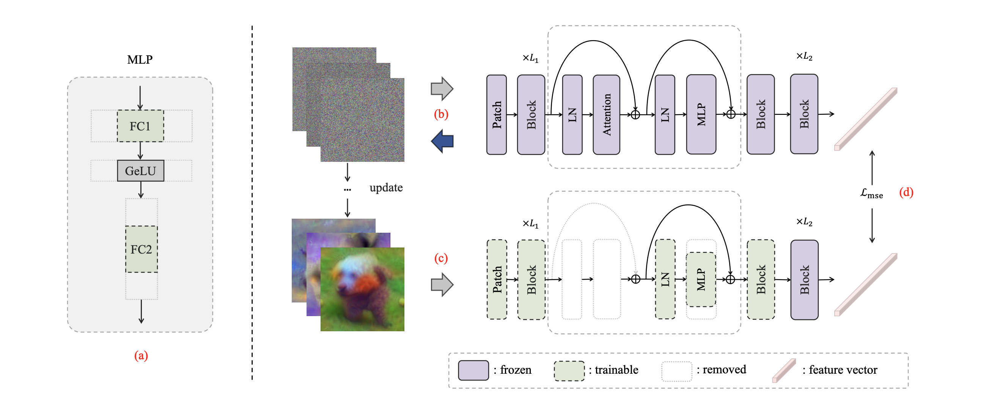

<!--  -->
# Dense Vision Transformer Compression with Few Samples

This repository is the official PyTorch implementation of [Dense Vision Transformer Compression with Few Samples](https://arxiv.org/abs/2403.18708) presented at CVPR 2024.

The code will help to do fewshot compression for Vision Transformers (ViT) with only a tiny training set (even without labels). The overall framework is illustrated in this Figure: 



## Requirements

Code was tested in virtual environment with Python 3.8. Install requirements:

```setup
pip install torch==1.4.0
pip install torchvision==0.5.0
pip install numpy
pip install Pillow
```

## Datasets
Please prepare datasets first, and then modify the paths in `src/dataset.py`.

## Running the code
The implementation of our method can be divided into three primary stages:
- Determine the network structure and prune block-wisely
- Generate a synthetic metric set
- Choose the blocks to compress progressively

### Stage 1: Generate a synthetic metric set
In our method, the step of generating synthetic metric datasets is implemented using code from [Dreaming to Distill: Data-free Knowledge Transfer via DeepInversion](https://arxiv.org/abs/1912.08795) presented at CVPR 2020. 

This snippet will generate 50 images by inverting ViT-Base from torchvision package. The scripts of using other networks are in script.sh.
```
cd gen_metric
python imagenet_inversion.py --bs=50 --do_flip --exp_name="vit_base_inversion" --r_feature=0.01 --arch_name="vit_base_patch16_224" --adi_scale=0.0 --setting_id=1 --lr 0.25 --store_best_images --iter_num 2000 --seed 2023 --gpu_id 0 --beta 0.6
```

Arguments:
- `bs` - batch size, should be close to original batch size during training, but not necessary.
- `lr` - learning rate for the optimizer of input tensor for model inversion.
- `do_flip` - will do random flipping between iterations
- `exp_name` - name of the experiment, will create folder with this name in `./generations/` where intermediate generations will be stored after 100 iterations
- `r_feature` - coefficient for feature distribution regularization, might need adjustment for other networks
- `arch_name` - name of the network architecture, should be one of pretrained models from torch vision package.
- `fp16` - enables FP16 training if needed, will use FP16 training via APEX AMP (O2 level)
- `verifier` - enables checking accuracy of generated images with another network after each 100 iterations.
Useful to observe generalizability of generated images.
- `setting_id` - settings for optimization: 0 - multi resolution scheme, 1 - 2k iterations full resolution, 2 - 20k iterations.
- `adi_scale` - competition coefficient. With positive value will lead to images that are good for the original model, but bad for verifier.
- `random_label` - randomly select classes for inversion. Without this argument the code will generate hand picked classes.

### Stage 2: Determine the network structure and prune block-wisely
Run the following command to obtain the blocks sorted by the value of metric loss, you can find the result in the log file.
```
python run_metric_blks.py --seed 2023 --comp-ratio 0.751734186 --model vit_base_patch16_224 --epochs 2000 --num-sample 50 --metric-dataset DI_gen --gpu-id 0
```

Arguments:
- `comp-ratio` - compression ratio, the value in this example is chosen to keep the MACs similar to the compared method in the paper, you can try other values as well.
- `model` - model name, you can also try other models in ViT series.
- `num-sample` - number of samples used to finetune the pruned models, you can also try 100, 500, 1000 or other values.
- `metric-dataset` - name of metric dataset used to evaluate the recoverability of different blocks, DI_gen is the generated dataset in the first stage, you can add other datasets to `src/dataset.py` and try.

### Stage 3: Choose the blocks to compress progressively
```
python run_prune.py --seed 2023 --model vit_base_patch16_224 --comp-ratio 0.751734186 --num-sample 50 --epochs 2000 --metric-dataset DI_gen --best-blocks 2,4,1,3 --gpu-id 0
```
After sorting the blocks in last stage, set the indexes of blocks (e.g 2,4,1,3) with best recoverability as the `best-blocks`, remember to set `comp-ratio` and `metric-dataset` same as stage 2.

## Citation
If you find the work useful for your research, please cite:
```bibtex
@inproceedings{zhang2024dense,
  title={Dense Vision Transformer Compression with Few Samples},
  author={Zhang, Hanxiao and Zhou, Yifan and Wang, Guo-Hua},
  booktitle={Proceedings of the IEEE/CVF Conference on Computer Vision and Pattern Recognition},
  pages={15825--15834},
  year={2024}
}
```